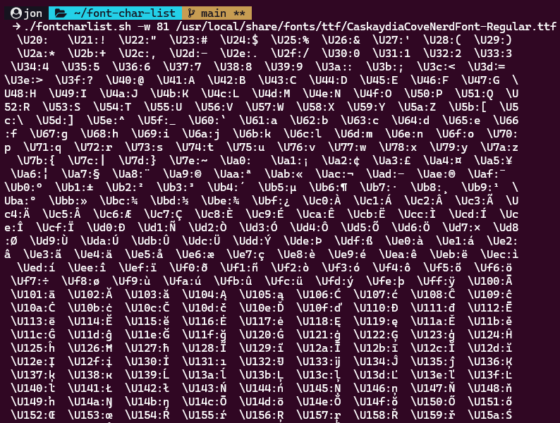
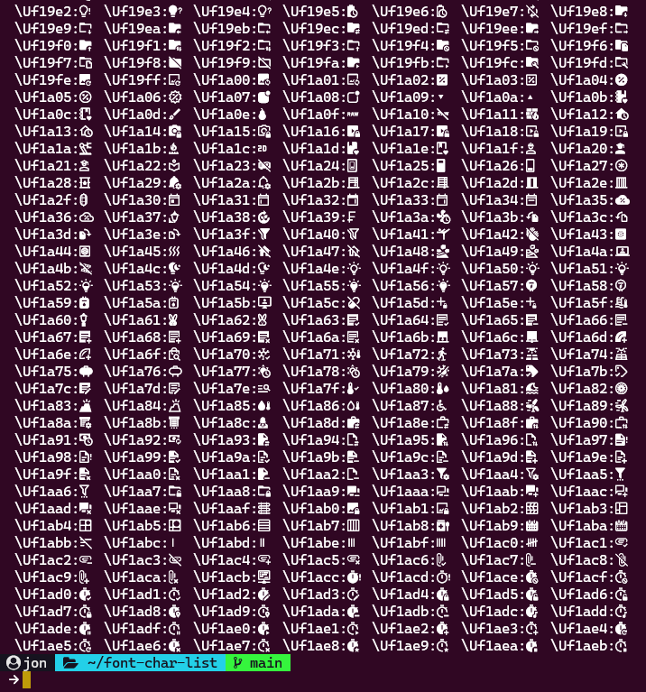

# fontcharlist.sh

Bash script to print out every valid character contained in a font.

## Note

This script is based on a [petrosAth/scripts](https://github.com/petrosAth/scripts/blob/master/fontcharlist.sh) script.

I was looking for a way to check the UTF values for some NerdFont icons, because the ones showing on their webpage weren't working. I came across [this](https://unix.stackexchange.com/questions/595756/how-to-list-all-supported-glyphs-of-a-given-font) page where someone posted the code for the script. It mentioned the name, so I looked it up and I found his GitHub repo.

I just tweaked the script a little so it worked exactly as I wanted. I'm uploading it here so I can always go back to it. Also just in case someone finds it and can have a better explanation for what it does and how works.

## Usage

This will print out all of the glyphs contained in the font **CaskaydiaCoveNerdFont-Regular.tty**:

`.fontcharlist.sh [-w width] /path/to/fileName.ttf`

You can look up the path+name to your fonts using the following command: `fc-list`  
Or use grep to filter the one you want: `fc-list | grep Caskaydia`

## Example

`./fontcharlist.sh -w 81 /usr/local/share/fonts/ttf/CaskaydiaCoveNerdFont-Regular.ttf`

  

  

